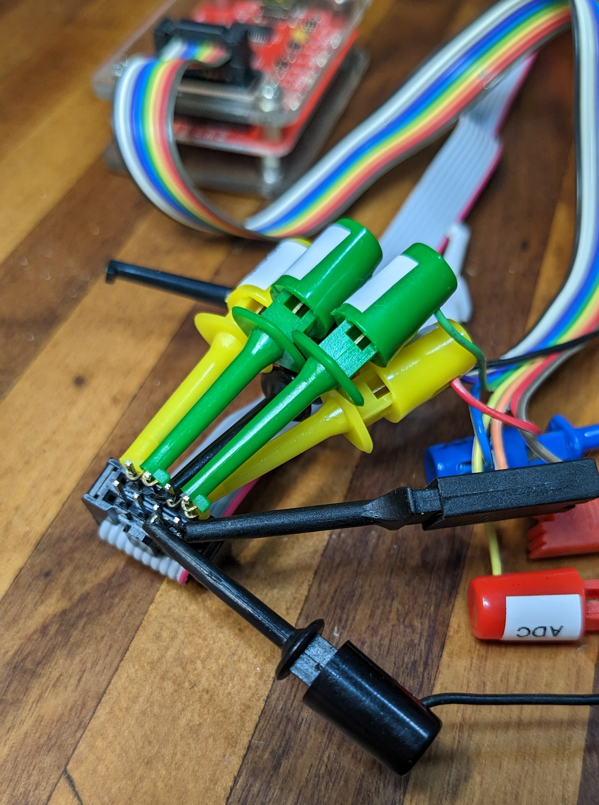

Uni-T UT210E Clamp Meter

# Uni-T UT210E Clamp Meter


This doc is the result of explorations into modding the Uni-T UT210E Clamp Meter; it's what I'd wish I'd had before wading through pages and pages of forum posts and datasheets across at least three languages. If you just want to know how to modify a UT210E using a Bus Pirate, skip to the [end](#readingwriting-the-eeprom-using-a-bus-pirate).

<!-- TOC -->

- [Uni-T UT210E Clamp Meter](#uni-t-ut210e-clamp-meter)
  - [Overview](#overview)
  - [Hacking](#hacking)
    - [Configuration Data](#configuration-data)
    - [Interesting Addresses](#interesting-addresses)
    - [Timeouts](#timeouts)
    - [Modes](#modes)
      - [Meter Labelling / OEM Spec vs Chipset Modes](#meter-labelling--oem-spec-vs-chipset-modes)
      - [Changing Meter Function](#changing-meter-function)
    - [Ranging](#ranging)
    - [Changing Counts](#changing-counts)
      - [AC RMS Headroom](#ac-rms-headroom)
      - [Zeroing & Auto-Range Limitation](#zeroing--auto-range-limitation)
      - [Zeroing 2000 Counts Bug](#zeroing-2000-counts-bug)
  - [Reading/Writing the EEPROM Using a Bus Pirate](#readingwriting-the-eeprom-using-a-bus-pirate)
    - [Configuration](#configuration)
      - [Modify the auto-off and backlight times](#modify-the-auto-off-and-backlight-times)
      - [Other Mods](#other-mods)

<!-- /TOC -->

## Overview

Specifications (OEM/as-manufactured)

* 2000 [count](https://www.fluke.com/en-au/learn/best-practices/test-tools-basics/digital-multimeters/accuracy-resolution-range-counts-digits-precision) resolution
* 0.7% DC [accuracy](https://www.tek.com/document/whitepaper/understanding-handheld-dmm-specifications)
* AC bandwidth 1kHz (DTM0660L ASIC datasheet), measured to ~3 kHz ([ref](https://www.markhennessy.co.uk/budget_multimeters/unit_ut210e.htm)), True RMS ("virtual", using DSP)
* DC current measurement, 2A-100A ranges, ~2% accuracy
* Non-Contact Voltmeter (NCV)
* 600V Cat II (safe for mains appliances, etc)
* continuity, resistance, diode check and wide ranging capacitance

Pros

+ good specs for the price
+ diode test 3.25V (so can test blue and white LEDs)
+ DMM IC has been community documented incl. EEPROM configuration, i.e. "hackable"

Cons

- clamp meter is very sensitive to metal and magnetic fields and cable orientation
- can't handle AC with a DC offset ([ref](https://www.markhennessy.co.uk/budget_multimeters/unit_ut210e.htm))
- Voltage and Ω/F are auto-range only; current is manual ranging only
- RMS is [calculated via DSP](https://www.electronics-tutorials.ws/accircuits/rms-voltage.html) rather than directly measured, this has ramifications if modifying the meter's ranges
- not the fastest display update rate nor auto-ranging response

Misc functions/features

* all ranges start on AC, have to press Select button to change to DC (can be modded)
* auto power off (APO) (15 mins, can be modded)
  * LCD indicator when APO is enabled: 
  * hold down SELECT button during power on to disable
* beeper sounds on over-range (can be modded)
* "VFC": apparently reduces bandwidth to 400Hz - intended for measurements on switched variable frequency systems (e.g. motors)

Reviews

* [https://lygte-info.dk/review/DMMUNI-TUT210E%20UK.html](https://lygte-info.dk/review/DMMUNI-TUT210E%20UK.html)
* https://www.markhennessy.co.uk/budget_multimeters/unit_ut210e.htm

## Hacking

Refs:

* [https://www.eevblog.com/forum/testgear/a-look-at-the-uni-t-ut210e/](https://www.eevblog.com/forum/testgear/a-look-at-the-uni-t-ut210e/)
* [http://www.kerrywong.com/2016/03/19/hacking-dtm0660l-based-multimeters/](http://www.kerrywong.com/2016/03/19/hacking-dtm0660l-based-multimeters/)

The meter is built around a Digital Multimeter (DMM) ASIC, two variants have been used at various times:

1. DTM0660L (older units)
  * [partially translated DTM0660 data sheet](http://www.kerrywong.com/blog/wp-content/uploads/2016/04/DTM0660DataSheet.pdf)
  * maximum count: 4000/6000 (9999 for frequency and capacitance)
2. DM1106EN (newer units)
  * maximum count 9999

The above ASICs are allegedely clones or rebranded versions of the HyconTek [HY12P66]([http://www.hycontek.com/wp-content/uploads/DS-HY12P65-EN.pdf).

The ASIC's configuration is stored on EEPROM and can be modified to:

* change the backlight and auto power off times
* default to DC than AC for voltage and current modes
* change number of counts: from 2000 to 6000
* ? enable support for [sigrok](https://sigrok.org/) via serial/UART (requires additional hardware modification)

Device-specific calibration data is also stored in the EEPROM so need to be careful and only selectively modify its contents.

The EEPROM is a [DM24C02A](http://ww1.microchip.com/downloads/en/DeviceDoc/I2C%20Serial%20EE%20Family%20Data%20Sheet%2021930C.pdf) 2kbit (256 byte) I2C SOIC8 device, with the necessary pins available on an unpopulated 2mm-pitch jumper/connector CZ1. A SOIC clip works fine, but may need the neighbouring caps nudged aside.


The CZ1 connections are directly to the EEPROMs power and data pins, and presuming CZ1's "pin 1" is the pin closest to the crystal (i.e. the photo above is upside-down), we have:

    1: Vcc (+3.3V)
    2: WP
    3: SCL
    4: SDA
    5: Vss (0V)


(aside: the DM24C02A is CMOS, so Vcc should be labelled as V<sub>DD</sub>)

Note that the testpoint marked GND on the board near C2 is analogue input ground, not Vss / battery negative.

Reading/writing the EEPROM:
- the ASIC should be held in reset: pin 55 to GND
  - pin 55 is connected to GND via C5 (and to V<sub>DD</sub>/+3 V via R1, making an RC reset circuit)
    - i.e. temporarily short C5, or (potentially easier) hold a grounded probe on C5's leg closest to the ASIC when reading/writing
  - seems that if you leave the power on for a while you can get away with not holding the chip in reset, however if you're getting inconsistent results from read to read then you may be best to hold it reset
    - obviously you need to be confident you've made a good "backup" before doing any writes, and it's always a good idea to verify all writes by reading back
- the EEPROM's address bits are all tied low with a base address of 0x50, so the read/write "addresses" are
  - 0xA0(W)
  - 0xA1(R)

### Configuration Data

The ASIC is configured via various memory addresses in the EEPROM, documented in the chip's datasheet. Some are single-byte, others two-byte little-endian (i.e. least-significant byte in the lower address).

Aside: there's some misunderstanding and lack of clarity on the various information sources out there. Just because the datasheet implies something doesn't mean the UT210E hardware supports it. e.g. RS-232 output: the UT210E actually has this enabled in the ASIC's config but the hardware just isn't present ([ref](https://www.eevblog.com/forum/testgear/a-look-at-the-uni-t-ut210e/msg922407/#msg922407)). Despite that you'll see people simply writing a "magic value" 0xCE to the config address 0xFA, blowing away the other configuration bits at that address (the UT210E OEM value is 0xEF). The value 0xCE presumably chosen from an article on [a different meter that uses the same chipset](http://www.kerrywong.com/2016/03/19/hacking-dtm0660l-based-multimeters/). As always, take everything with a grain of salt.

### Interesting Addresses

The following are some of the interesting addresses from the datasheet, and the OEM values for a DTM0660L device.

|Address        |OEM Value      |Description    |
|---            |---            |---            |
|0x10-0x11      |0x1770         |full range (6000d = 0x1770; 8000d = 0x1F40)|
|0x12-0x13      |0x0898         |range switch upper (0x0898 = 2200d; 0x1838 = 6200d)|
|0x14-0x15      |0x00BE         |range switch lower (0x00BE = 190d; 0x0244 = 580d)|
|0x1C |0x0A |current range warning current (0x0A = 10A)|
|               |               |               |
|0x50-0x57      |               |current calibration data, 2-bytes/range|
|               |               |               |
|0x80-0xBF      |-              |"Measurement functionality setting" - operation of the selector switch and Mode button (see below)|
|               |               |               |
|0xFA           |0xEF           |bitmap: button/backlight function and pin config, incl. enable/disable RS-232 - though not supported on UT210E|
|0xFB           |0x0F           |Time before auto poweroff, minutes (1-255). Default: 15 minutes. 0: auto poweroff disabled|
|0xFC           |0x0F           |Backlight on duration, seconds (1-255). Default: 15 seconds. 0: backlight stays on.|
|0xFD           |0x80           |bitmap: incl. b3..0 = low voltage power off delay in seconds|

Refs:

* [https://www.eevblog.com/forum/testgear/a-look-at-the-uni-t-ut210e/msg1302533/#msg1302533](https://www.eevblog.com/forum/testgear/a-look-at-the-uni-t-ut210e/msg1302533/#msg1302533)

### Timeouts

Possibly the simplest change:

|Address|Initial|Change to      |                               |
|---    |---    |---            |---                            |
|0xFB   |0x0F   |0x1E           |auto power off: 30 mins        |
|0xFC   |0x0F   |0x00           |backlight auto-off: never      |

* backlight power consumption adds about 5 mA to the meter's usual power consumption (~1-2 mA on voltage, ~7 mA on current modes) ([ref](https://www.markhennessy.co.uk/budget_multimeters/unit_ut210e.htm))

### Modes

The function of the meter is controlled by two inputs: the mode selector switch and the Select button. A lookup table is used to map the various switch/button combinations to the actual meter function (the ASIC has around 30 separate functions). It's possible to remap quite a few functions, for example to swap the order of the AC and DC selections such that each mode starts out in DC. There are limitations on what can be remapped, see below.

The lookup table, called the "Measurement Function Setting" in the datasheet, is the 64 bytes from 0x80-0xBF in the configuration EEPROM. The Mode selector switch is connected to the ASIC via a 4-bit wide input (MEA4..1), this value maps to the least-significant nibble (i.e. right-most hex digit) of the lookup table address. The Select button (connected along with the other buttons via a multiplexed key input) increments a 2-bit counter on each press - this determines the lower 2 bits of the most significant nibble, i.e. 0x8x, 0x9x, 0xAx or 0xBx. (ref. section 11.4.3 in the Chinese datasheet). The Select counter seems to be reset on Mode switch change.

If the lookup table is envisaged as conventional 16-byte rows then each press of the Select button increments the row and the mode switch switches columns. For the UT210E, there are six modes available, at offsets x7 and xB-xF. The function codes for the modes that can't be selected are all 0x00. Here's the OEM configuration:

|          | 0    | ...  | 7    | ...  | B     | C     | D      | E       | F       |
| -------- | ---- | ---- | ---- | ---- | ----- | ----- | ------ | ------- | ------- |
| *Mode*:  |      |      | *2A* |      | *20A* | *NCV* | *100A* | *Volts* | *Ω/etc* |
| **0x80** | 0x00 | ...  | 0x17 | ...  | 0x19  | 0x1E  | 0x1B   | 0x04    | 0x07    |
| **0x90** | 0x00 | ...  | 0x16 | ...  | 0x18  | 0x00  | 0x1A   | 0x05    | 0x09    |
| **0xA0** | 0x00 | ...  | 0x00 | ...  | 0x00  | 0x00  | 0x00   | 0x00    | 0x0A    |
| **0xB0** | 0x00 | ...  | 0x00 | ...  | 0x00  | 0x00  | 0x00   | 0x00    | 0x0B    |


The datasheet table 11.3, "EEPROM Measurement Function Setting" provides the description of the function associated with each value. Column titles in English are:

Column 1: Measurement Function Code
Column 2: Jumper
Column 3: Function Description

The entry for 00h is "no function" / "no capability".


So it can be seen, for example, that the default behaviour for the UT210E in 2A mode (EEPROM address 0x87) is 0x17 "ACA 6.000A", or low-range AC current. On one press of the Select button the address changes to 0x97 which is function 0x16 "DCA 6.000A", or low-range DC current.

Function values of 0x00 are skipped over.

#### Meter Labelling / OEM Spec vs Chipset Modes

As can be seen from the datasheet table 11.3, the chipset modes are all "6000 count", e.g. 60.00 mV, 600.0 Ω, 6.000 A, 6000 A, etc (the upper voltages are presumably restrained in documentation for safety/class reasons; also note the capacitance is 9999 count as capacitance is [measured differently](https://meettechniek.info/passive/capacitance.html) than the V/A/Ω modes). Despite this the meter itself is labelled as, and OEM configured for, 2000 count. That is, what is labelled on the meter as the 2 A mode is actually the 6.000 A mode, artificially limited by configuration (see [Changing Counts](#changing-counts) below).

In this doc, the meter label and chipset mode terms are used interchangeably. i.e. The "2A mode" is referring to mode 0x16 (DCA 6.000A) and 0x17 (ACA 6.000A).

#### Changing Meter Function

It seems that functions that have the same value in column 2 of table 11.3 (J1, J1A, etc) can be freely exchanged for a given mode. So we can change the meter to default to DC measurements by swapping the values in the 0x8x and 0x9x rows for current and voltage, as follows:

|          | 0    | ...   | 7        | ...   | B        | C     | D        | E        | F       |
| -------- | ---- | ----- | -------- | ----- | -------- | ----- | -------- | -------- | ------- |
| *Mode:*  |      | *...* | *2A*     | *...* | *20A*    | *NCV* | *100A*   | *Volts*  | *Ω/etc* |
| **0x80** | 0x00 | ...   | **0x16** | ...   | **0x18** | 0x1E  | **0x1A** | **0x05** | 0x07    |
| **0x90** | 0x00 | ...   | **0x17** | ...   | **0x19** | 0x00  | **0x1B** | **0x04** | 0x09    |
| **0xA0** | 0x00 | ...   | 0x00     | ...   | 0x00     | 0x00  | 0x00     | 0x00     | 0x0A    |
| **0xB0** | 0x00 | ...   | 0x00     | ...   | 0x00     | 0x00  | 0x00     | 0x00     | 0x0B    |

You can add modes by setting the 0xAx and 0xBx addresses to the desired functions, for example to have four Voltage functions:

* DCV (no mV range) (0x03)
* ACV (no mV range) (0x04)
* DC w/ mV (0x05)
* AC w/ mV (0x06)

|          | 0    | ...   | 7    | ...   | B     | C     | D      | E        | F       |
| -------- | ---- | ----- | ---- | ----- | ----- | ----- | ------ | -------- | ------- |
| *Mode:*  |      | *...* | *2A* | *...* | *20A* | *NCV* | *100A* | *Volts*  | *Ω/etc* |
| **0x80** | 0x00 | ...   | 0x16 | ...   | 0x18  | 0x1E  | 0x1A   | **0x03** | 0x07    |
| **0x90** | 0x00 | ...   | 0x17 | ...   | 0x19  | 0x00  | 0x1B   | **0x04** | 0x09    |
| **0xA0** | 0x00 | ...   | 0x00 | ...   | 0x00  | 0x00  | 0x00   | **0x05** | 0x0A    |
| **0xB0** | 0x00 | ...   | 0x00 | ...   | 0x00  | 0x00  | 0x00   | **0x06** | 0x0B    |

### Ranging

As indicated in the Mode configuration table the ASIC is capable of a variety of manual and auto-ranging operations. However the UT210E does not include the necessary Range button and as such is configured to use auto-range modes for AC and DC Voltage, Resistance and Capacitance. No manual range operation is available for these modes.

Current measurements are configured in hardware to use manual ranges only, by way of three positions available via the Mode selection switch. The OEM configuration uses the 6.000 A, 60.00 A and 600.0 A ranges. The ASIC appears to support auto-ranging current modes, but the datasheet indicates those can't be used with the UT210E's hardware Mode switch configuration. Refer the above Mode configuration, table 11.3, for the possible functions, observing the restrictions re. "jumpers". (TODO: try out an auto-ranging current function, see what happens. e.g. add functions 0x0E and 0x0F to the 2A mode.)

In addition to the range function configurations the meter has two configuration "range switch" parameters that define when it will either switch to a higher (or lower) range when auto-ranging in voltage/etc, or display OL for the current modes:

| Parameter          | Address   | OEM configuration | Datasheet default |
| ------------------ | --------- | ----------------- | ----------------- |
| full range         | 0x10-0x11 | 6000d             | 6000d             |
| range switch upper | 0x12-0x13 | 2200d             | 6200d             |
| range switch lower | 0x14-0x15 | 190d              | 580d              |

When the measured value goes over the range switch upper, the next range is selected (or OL displayed for manual ranging). When it drops below the range switch lower the next lower range is selected. i.e. the upper and lower switch points provide hysteresis to avoid too-frequent range changes. Presumably the ratio of the range lower to upper switch points must be less than 10 (each Mode range is a multiple of 10) otherwise the meter will switch range right back again. e.g. if the lower switch only was changed to 300d (> 2200/10d), a measured value of 250d would cause a range change down with the resulting new measurement becoming 2500d, in turn causing a range change up; rinse-wash-repeat.

The UT210E's OEM configured range upper limit is unexpectedly low; this essentially artificially restricts the meter to the advertised 2000 counts. See below re. changing this.

It's unknown what the "full range" parameter actually does (TODO: check relationship with OL behaviour).

"Calibration Data"

The EEPROM contains a number of entries labelled "calibration adjustment ratio" and "range noise to be subtracted" (voltage ranges). These sound a lot like gain and offset values. For example, for the current ranges:

| Address   | Range  | OEM Value (meter1: DTM0660L) | OEM Value (meter2: DM1106EN) |
| --------- | ------ | ---------------------------- | ---------------------------- |
| 0x50-0x51 | 6 A    | 0x7F2B                       | 0x7D71                       |
| 0x52-0x53 | 60 A   | 0x7997                       | 0x775B                       |
| 0x54-0x55 | 600 A  | 0x8000 (default)             | 0x8000 (default)             |
| 0x56-0x57 | 6000 A | 0x8000 (default)             | 0x8000 (default)             |

The normally unused 600A and 6000A ranges are the default 0x8000 (i.e. uncalibrated?). The 6000A range can be used with the 6A calibration values to workaround a bug, see the Zeroing 2000 Counts Bug below.

### Changing Counts

The UT210E is [specified](https://www.tek.com/document/whitepaper/understanding-handheld-dmm-specifications) as a 2000 count resolution though as described above it's artificially degraded to this specification. The UT210E's ASIC is specced to 6000 count (DTM0660L, 9999 for the DM1106EN), however is _effectively_ 2200 count due to the auto-range limits. This is because when reaching the artificially restricted range switch limits the the meter will switch to the next higher or lower range for Voltage measurement, or over-range for current and wait for you to switch modes. The reason why the effective range is curtailed is probably mostly model differentiation, the UT211 series is similar to the UT210 but with 6000 count out of the box.

The extended range provides better resolution for values in that extra range. For example, a reading of 4.321 V DC could be measured to 3 places on one of the 6.000 DCV modes (0x03 or 0x05 in table 11.3), yet by default the meter will switch range to the 60.00 DCV range and display this as 4.32 V (for current ranges it will prematurely display OL).

It's unclear what the full range value is (EEPROM addresses 0x10-0x11, OEM and datasheet default is 6000d); the DTM0660L datasheet notes the ASIC has a maximum count of 6600 (the DM1106EN 9999) but table 11.3 shows all the Modes as essentially 6000 count.

#### AC RMS Headroom

Rather than use a hardware IC to measure the RMS value of an AC waveform, the ASIC's "virtual" True RMS implementation uses DSP to calculate the input's RMS value. This necessitates oversampling the waveform with sufficient headroom to capture the peak values of the input waveform.

The range is selected to accommodate "common" AC waveforms, for example a pure sinusoid with an RMS value of 4600 counts would actually be close to 6600 peak (4600 * √2). More complex AC waveforms will have higher peaks ([crest factor](https://en.wikipedia.org/wiki/Crest_factor)); a half-wave rectified waveform has a crest factor of 2, a decent True RMS chip (AD8436) can handle crest factor 10.

The ADC is apparently a 14-bit delta-sigma oversampling at "up to" 12.5kHz, with a bandwidth of 1kHz. Assuming a rectified input and the stated 14-bits is the effective resolution, the ADC provides a range of 16384 counts. (For comparison, the Hycon HY12P66 ASIC internal block diagram shows a 19-bit ADC feed into the RMS DSP). With a specced count of 6000, an effective 14-bit ADC allows a crest factor of 16k/6000 ~= 2.7, which is low but seems reasonable for this class of meter.

Conclusion: it seems reasonable to leave the range limit set to the OEM-shipped and ASIC default of 6000, and to set the upper and lower auto-range switches also to their ASIC default values, resulting in a 6000-count meter that can handle crest factors up to around 2.7.

The DM1106EN ASIC is specced to 9999 counts, it's unclear what that actually means in terms of the above. Perhaps the internal ADC has an additional bit.

Note that at the upper limits of the devices ranges, other parameters come into play: for example, the meter current measurement error, typically ~3%, starts heading north of 5% above about 150 A ([e.g.](https://www.eevblog.com/forum/testgear/a-look-at-the-uni-t-ut210e/msg1352044/#msg1352044)).

#### Zeroing & Auto-Range Limitation

The DTM0660L (and DM1106EN?) has a limitation/feature in that when the Zero function is used the meter will not auto-range. When it hits the measured - not displayed - count where it would normally switch ranges it will instead display OL.

For example, on Voltage mode:

| Input Voltage | Meter | Comment                            |
| ------------- | ----- | ---------------------------------- |
| 5.00          | 05.00 | initial reading                    |
| 5.00          | 00.00 | zeroed                             |
| 19.90         | 14.91 | ok                                 |
| 21.90         | 16.92 | ok                                 |
| 22.00         | OL    | exceeded range switch count (2200) |

This also occurs on the current ranges, though it's more noticeable here as current measurements are generally always zeroed due to clamp meter offset.

#### Zeroing 2000 Counts Bug

Separately to the above auto-range / OL limitation, the 2A mode has a "bug" where when zeroed the count range limits are fixed to around 2000 counts; the range switch limits configured in the EEPROM are ignored. This means that attempting to increase the meter count ranges is practically ineffective for the 2A mode. (The 20A/60A mode isn't affected and reflects the configured range limits regardless of being zeroed or not; presumably the 100A range is the same (untested)).

For example, with the meter configured with the datasheet defaults (full range 6000d, range switch upper 6200d, range switch lower 580d), the voltage and resistance/etc ranges are now "6000 count" - that is, they switch up and down ranges at around the 6000 mark. The 2A current mode also reads fine up to around 6A - when not zeroed. If the meter is zeroed at all, even with a modest offset (say 50 counts), then it will OL at around 2.2A.

A workaround is to use the "6000A" range on the 2A mode, copying over the 2A/6A calibration data. The result is a display that effectively reads in mA up to the given count - a so-called "dotless" mode. e.g. 245 mA reads 0.245 on an OEM meter, and 0245 in "dotless" mode. Alas, the meter's units display A, not mA; so it's not quite perfect.

To copy the calibration data, copy the 2 bytes over from 0x50-51 to 0x56-57.

It's possible to have both the 6000 A (AC and DC) modes in addition to the (limited) 2 A mode (write mode 0x1C to address 0xA7, and 0x1D to 0xB7), or to simply replace the existing 2 A modes: write 0x1C to 0x87, and 0x1D to 0x97.

Finally, when this is done you'll have one remaining problem: a warning beep whenever the meter thinks it's exceeding 10A, configured via the value at address 0x1C; silence this by writing 0xFF to 0x1C.

## Reading/Writing the EEPROM Using a Bus Pirate

Any I2C setup can be used to read and write the EEPROM. Below is one arrangement using the [Bus Pirate](http://dangerousprototypes.com/docs/Bus_Pirate) and a cheap SOIC8 clip. The SOIC8 clip cable is terminated to an IDC connector, making for convenient connection to each of the IC's pins.

Bus Pirate Connections (wire colour refers to the jumper/patch wires in the following image); ground/GND refers to Vss, not the meter's analogue ground:

| IC   | Pin  | Bus Pirate (clip colour)         | Wire colour |
| ---- | ---- | -------------------------------- | ----------- |
| +3.3 | 8    | P2 3V3 (yellow) + P5 VPU (green) | red         |
| WP   | 7    | n/c (gnd)                        | orange/pink |
| SCL  | 6    | P7 CLK (green)                   | light blue  |
| SDA  | 5    | P8 MOSI (yellow)                 | blue        |
| Vss  | 4    | P1 GND (black)                   | black       |

Note the pull-up connection to 3V3, and the (orange/pink) jumper from the IC's WP to one of the spare grounded address pins (i.e. the IC's pin 7 is connected to any of pins 1, 2 or 3). Also, an additional ground connection ought to be used to reset the ASIC; this can be a jumper from another of the spare address pins. I found that I didn't need to hold the ASIC in reset if I waited a minute after applying power; sometimes it's ok to live a little dangerously (so long as you verify what you've read and written).



(not shown  in the above is the additional flying lead from a spare ground on the IDC connector, used to 'probe' the side of C5's leg closest to the ASIC so as to hold the ASIC in reset)

Physical setup: remove the batteries, turn the meter's function dial to anywhere but 'off', remove the back case, attach the SOIC clip, patch it to the BP per the above.

Set up the BP, check voltages (SCA, SCL should be High, if not check pullups are enabled), and dump the entire EEPROM (256 bytes):

```
touchy:~% screen /dev/tty.usbserial-AD01W2SL 115200
HiZ>
HiZ>m
1. HiZ
2. 1-WIRE
3. UART
4. I2C
5. SPI
6. 2WIRE
7. 3WIRE
8. LCD
9. DIO
x. exit(without change)

(1)>4
Set speed:
 1. ~5KHz
 2. ~50KHz
 3. ~100KHz
 4. ~400KHz

(1)>4
Ready
I2C>W
Power supplies ON
I2C>P
Pull-up resistors ON
I2C>v
Pinstates:
1.(BR)  2.(RD)  3.(OR)  4.(YW)  5.(GN)  6.(BL)  7.(PU)  8.(GR)  9.(WT)  0.(Blk)
GND     3.3V    5.0V    ADC     VPU     AUX     SCL     SDA     -       -
P       P       P       I       I       I       I       I       I       I
GND     3.29V   5.05V   0.00V   3.30V   L       H       H       H       H
I2C>(1)
Searching I2C address space. Found devices at:
0xA0(0x50 W) 0xA1(0x50 R) 


I2C>[0xA0 0x00 [0xA1 r:256]
I2C START BIT
WRITE: 0xA0 ACK 
WRITE: 0x00 ACK 
I2C START BIT
WRITE: 0xA1 ACK 
READ: 0xFF  ACK 0xFF  ACK 0xFF  ACK 0xFF  ACK 0xFF  ACK 0x00  ACK 0x80  ACK 0xE8  ACK 0x03  ACK 0xE8  ACK 0x03  ACK 0xFA  ACK 0x00  ACK 0x00  ACK 0xBE  ACK 0x03  ACK 0x70  ACK 0x17  ACK 0x98  ACK 0x08  ACK 0xBE  ACK 0x00  ACK 0x3D  ACK 0x3D  ACK 0x3C  ACK 0x3C  ACK 0xFF  ACK 0xFF  ACK 0x0A  ACK 0xFF  ACK 0x40  ACK 0xFF  ACK 0x0F  ACK 0x99  ACK 0xCD  ACK 0x81  ACK 0x64  ACK 0x00  ACK 0x96  ACK 0x00  ACK 0x00  ACK 0x80  ACK 0x17  ACK 0x80  ACK 0xFB  ACK 0x7E  ACK 0x38  ACK 0x75  ACK 0x4E  ACK 0x02  ACK 0x09  ACK 0x8A  ACK 0xFF  ACK 0x08  ACK 0x1F  ACK 0x03  ACK 0x0B  ACK 0x7A  ACK 0x13  ACK 0x0A  ACK 0xA8  ACK 0x03  ACK 0x0A  ACK 0x00  ACK 0x00  ACK 0x01  ACK 0x00  ACK 0x01  ACK 0x00  ACK 0x07  ACK 0x98  ACK 0x00  ACK 0x64  ACK 0x00  ACK 0x64  ACK 0x00  ACK 0x64  ACK 0x00  ACK 0x00  ACK 0x00  ACK 0x2B  ACK 0x7F  ACK 0x97  ACK 0x79  ACK 0x00  ACK 0x80  ACK 0x00  ACK 0x80  ACK 0x00  ACK 0x00  ACK 0x00  ACK 0x00  ACK 0x01  ACK 0x00  ACK 0x00  ACK 0x00  ACK 0xE3  ACK 0x7F  ACK 0x48  ACK 0x7E  ACK 0x01  ACK 0x00  ACK 0x87  ACK 0x2A  ACK 0x00  ACK 0x00  ACK 0x00  ACK 0x00  ACK 0x00  ACK 0x00  ACK 0x00  ACK 0x00  ACK 0x85  ACK 0x80  ACK 0x00  ACK 0x80  ACK 0x07  ACK 0x7F  ACK 0xE0  ACK 0x7C  ACK 0x12  ACK 0x06  ACK 0x00  ACK 0x00  ACK 0x00  ACK 0x00  ACK 0x00  ACK 0x00  ACK 0x00  ACK 0x00  ACK 0x00  ACK 0x00  ACK 0x00  ACK 0x00  ACK 0x00  ACK 0x17  ACK 0x00  ACK 0x00  ACK 0x00  ACK 0x19  ACK 0x1E  ACK 0x1B  ACK 0x04  ACK 0x07  ACK 0x00  ACK 0x00  ACK 0x00  ACK 0x00  ACK 0x00  ACK 0x00  ACK 0x00  ACK 0x16  ACK 0x00  ACK 0x00  ACK 0x00  ACK 0x18  ACK 0x00  ACK 0x1A  ACK 0x05  ACK 0x09  ACK 0x00  ACK 0x00  ACK 0x00  ACK 0x00  ACK 0x00  ACK 0x00  ACK 0x00  ACK 0x00  ACK 0x00  ACK 0x00  ACK 0x00  ACK 0x00  ACK 0x00  ACK 0x00  ACK 0x00  ACK 0x0A  ACK 0x00  ACK 0x00  ACK 0x00  ACK 0x00  ACK 0x00  ACK 0x00  ACK 0x00  ACK 0x00  ACK 0x00  ACK 0x00  ACK 0x00  ACK 0x00  ACK 0x00  ACK 0x00  ACK 0x00  ACK 0x0B  ACK 0x0D  ACK 0x00  ACK 0x02  ACK 0x30  ACK 0x0D  ACK 0x00  ACK 0x03  ACK 0x20  ACK 0x20  ACK 0x00  ACK 0x03  ACK 0x20  ACK 0x20  ACK 0x00  ACK 0x03  ACK 0x10  ACK 0x41  ACK 0x00  ACK 0x03  ACK 0x08  ACK 0x41  ACK 0x00  ACK 0x03  ACK 0x05  ACK 0x41  ACK 0x00  ACK 0x03  ACK 0x05  ACK 0x0D  ACK 0x00  ACK 0x02  ACK 0x30  ACK 0x00  ACK 0x80  ACK 0x00  ACK 0x80  ACK 0x00  ACK 0x80  ACK 0x00  ACK 0x80  ACK 0x00  ACK 0x80  ACK 0x1F  ACK 0x02  ACK 0xA5  ACK 0x03  ACK 0x0B  ACK 0x05  ACK 0x25  ACK 0x02  ACK 0xB1  ACK 0x03  ACK 0x26  ACK 0x05  ACK 0x00  ACK 0x80  ACK 0x5A  ACK 0xC7  ACK 0xEF  ACK 0x0F  ACK 0x0F  ACK 0x80  ACK 0x00  ACK 0x00 
NACK
I2C STOP BIT
I2C>

```

You should dump the EEPROM multiple times to verify you're seeing consistent results, and be careful not to bump anything once you are. You may need to reset the ASIC, as above.

### Configuration

#### Modify the auto-off and backlight times

To 30 minutes (0x1E) and 255 seconds (0xFF), respectively:

```
I2C>[0xA0 0xFB [0xA1 r]
I2C START BIT
WRITE: 0xA0 ACK 
WRITE: 0xFB ACK 
I2C START BIT
WRITE: 0xA1 ACK 
READ: 0x0F 
NACK
I2C STOP BIT
I2C>[0xA0 0xFB 0x1E]
...
I2C>[0xa0 0xfb [0xa1 r]
…
READ: 0x1E 
NACK
I2C STOP BIT
I2C>[0xA0 0xFC [0xA1 r]
…
READ: 0x0F 
NACK
I2C STOP BIT
I2C>[0xA0 0xFC 0xFF]
…
I2C>[0xa0 0xfc [0xa1 r]
…
READ: 0xFF 
NACK
I2C STOP BIT
```

#### Other Mods

```
# auto-off timeout: 30 mins
[0xA0 0xFB 0x1E]

# backlight auto-off: never
[0xA0 0xFC 0x00]


# swap AC/DC default for 2A, 20A, 100A, V modes
[0xA0 0x87 0x16]
[0xA0 0x97 0x17]

[0xA0 0x8B 0x18]
[0xA0 0x9B 0x19]

[0xA0 0x8D 0x1A]
[0xA0 0x9D 0x1B]

[0xA0 0x8E 0x05]
[0xA0 0x9E 0x04]

# read it all back
[0xA0 0x00 [0xA1 r:256]


# change range limits (release the counts!)

## change range upper to 6200 (0x1838)
[0xA0 0x12 0x38 0x18]
## change range lower to 580d (0x0244)
[0xA0 0x14 0x44 0x02]


# workaround 2A zeroing bug: go "dotless" (6000A mode)
## copy over 6A cal data
[0xa0 0x50 [0xa1 r:2]
...
READ: 0x2B  ACK 0x7F 
## so 6A cal data is 0x2B 0x7F for this meter

## copy to the 6000A cal data
[0xA0 0x56 0x2B 0x7F]


## replace 2A mode with 6000A DC, 6000A AC (i.e. "dotless")
[0xA0 0x87 0x1C]
[0xA0 0x97 0x1D]

## silence warning beep
[0xA0 0x1C 0xFF]
```
